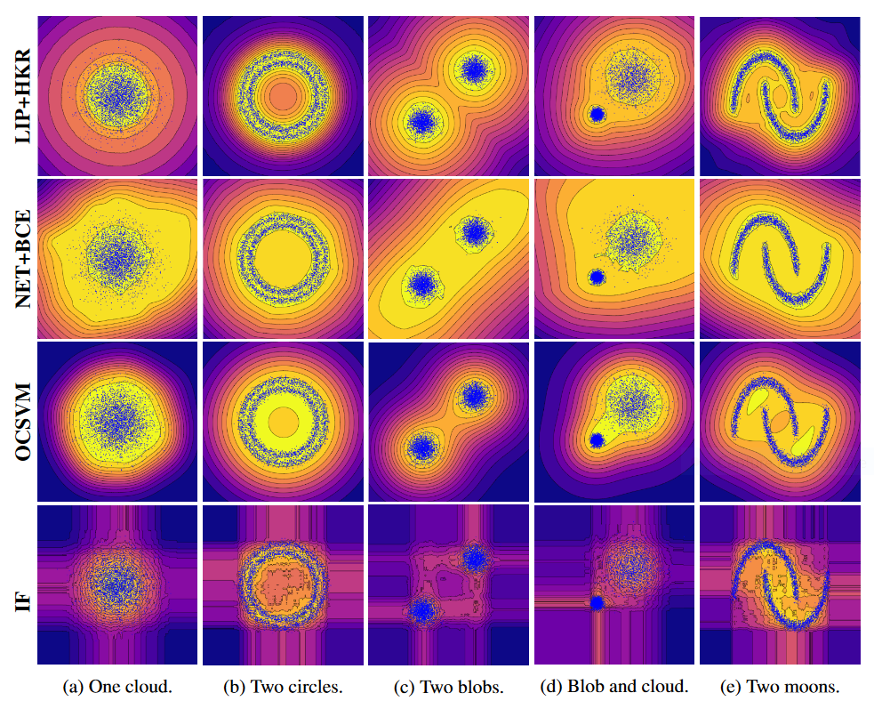
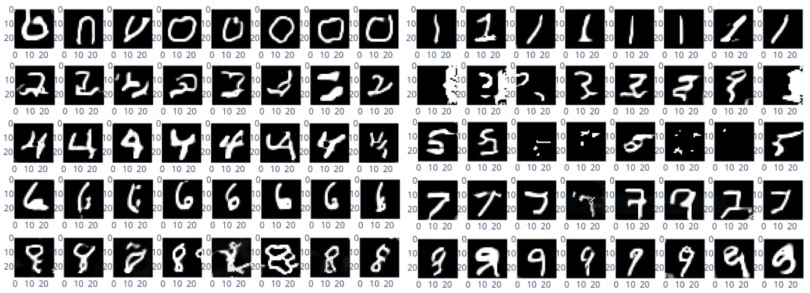

## One Class Metric Learning

Learn to approximate the Sign Distance Function (SDF) to the boundary of a distribution, i.e a dataset.

Use a combination of Lipschitz networks, adversarial training and Hinge Kabntorovich Rubinstein loss (HKR).

### Remarks

The notebooks currently use `Wandb` for experiment tracking, and `plotly` for plotting.

### Toy examples

The entry point is the notebook `OneClassDraft.ipynb` with 2D toy examples. It contains useful comments and documentation, before moving on to other notebooks. 

The algorithm is competitive against conventional networks and older ML methods, as illustrated below.

### Mnist examples

Larger scale experiments can be found in notebook `OneClassMnist.ipynb`. In particular the code for image generation in a GAN-like procedure:

