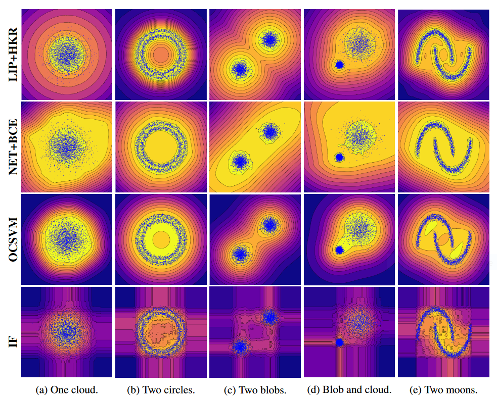
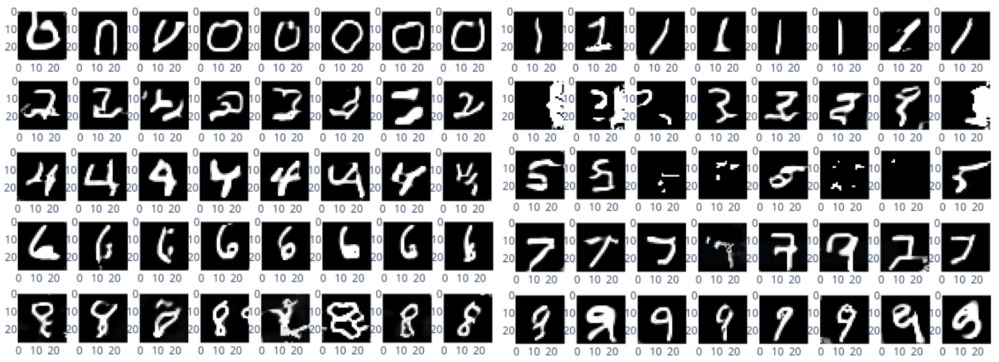

## 1-Lipschitz Signed Distance Function
Learn to approximate the Sign Distance Function (SDF) to the boundary of a distribution (e.g a dataset or a point cloud).

Use a combination of Lipschitz networks, adversarial training and Hinge Kantorovich Rubinstein loss (HKR).

## Structure of the repository

The repository is organized as follow:
  * `run_*.ipynb` notebooks launchs predefined configurations, datasets, create model, train it, and log the results.
    - `run_toy2d.ipynb` for toy examples in 2D (see figure above).
    - `run_tabular.ipynb` for tabular data (Thyroid, Mammography, etc) in anomaly detection.
    - `run_mnist.ipynb` for simple images from Mnist.
    - `run_fashion_mnist.ipynb` for harder task on Fashion Mnist.
    - `run_sdf.ipynb` for implicit surface parametrization in 3D.
    - `run_cat_dogs.ipynb` for challenging experiments on the high dimensional cats versus dogs dataset.
  * `ocml/`: contains all source files.
  * `experiments/`: contains the scripts to launch several experiments sequentially and upload the results to a wandb account. You should login on Wandb before running the scripts.
  * `legacy_notebooks/`: old notebooks for early experiments and prototypes. Saved for reproducibility and archiving. Should be avoided for new experiments.

### Remarks

`Wandb` is used experiment tracking, `plotly` and `seaborn` are used for plotting. Latest version of `deel-lip` is recommanded.

### Run the code

The following directories will be populated:

  * `images/`: record images produced for uploading to `wandb`.
  * `weights/`: contain weights of the network architecture in `.h5` format.
  * `wandb/`: if wandb is used - to store local variables.

